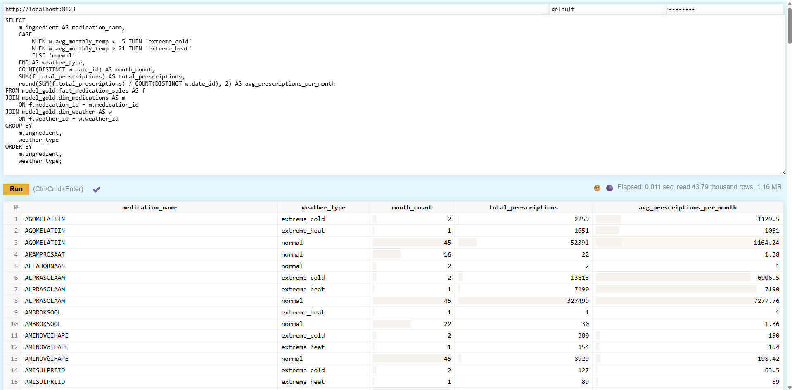
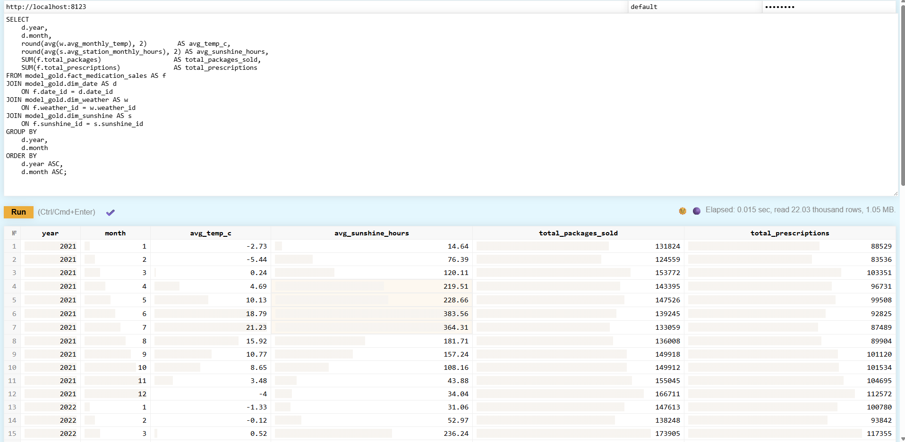

# Data Engineering 2025 – Project
**Group 4:** Annika Remmelgas, Agnes Kala, Imbi Jaks, Liis Andresen  

## Project Overview
This project implements a complete **data-warehouse & ETL pipeline** that analyzes how **weather conditions** and **sunshine** relate to **medication sales in Estonia**.

**Goal:** support healthcare planning by exploring correlations between climate and medication demand.  

**Key KPIs**
- Medications sold per month  
- Average temperature per month  
- Average sunny hours per month  

**Main business questions**
1. How does monthly average temperature affect the volume of medication purchases?
2. Are there specific types of medications (cold/flu, allergy, depression) that show seasonal spikes related to weather conditions?
3. Does extreme weather (heatwaves, cold) correlate with higher prescription rates for certain diagnoses?
4. Can weather patterns be used to forecast future medication demand (for example flu outbreaks during colder months, depression increases during colder months)?
5. How many of various medications should be supplied per period?

## How to set up project

1. `git clone https://github.com/annikarrre/dataEng2025.git`
2. `cd dataEng2025`
3. Download data from: https://drive.google.com/drive/folders/196V5F5GRX0Hw5bQicj7xCjp4kZ0WxnYa and extract it to airflow/datasets folder
4. `cp .env.example .env`
5. `docker compose up -d --build`
6. `docker exec -it data_warehouse-clickhouse-1 clickhouse-client -u default --password mysecret --multiquery --queries-file=/sql/01_create_databases.sql`
7. `docker exec -it data_warehouse-clickhouse-1 clickhouse-client -u default --password mysecret --multiquery --queries-file=/sql/02_create_bronze_sunshine.sql`
8. `docker compose exec airflow-webserver airflow dags trigger bronze_sunshine_ingest`
9. `docker exec -it data_warehouse-clickhouse-1 clickhouse-client -u default --password mysecret --multiquery --queries-file=/sql/02_create_bronze_weather.sql`
10. `docker compose exec airflow-webserver airflow dags trigger bronze_weather_ingest`
11. `docker exec -it data_warehouse-clickhouse-1 clickhouse-client -u default --password mysecret --multiquery --queries-file=/sql/02_create_bronze_medication.sql`
12. `docker compose exec airflow-webserver airflow dags trigger bronze_medication_ingest`
13. `docker compose exec airflow-webserver bash -lc   'dbt run --profiles-dir /opt/airflow/dbt --project-dir /opt/airflow/dbt --select silver'`
14. `docker compose exec airflow-webserver bash -lc 'dbt run --profiles-dir /opt/airflow/dbt --project-dir /opt/airflow/dbt --select gold'`

For project 3 we created two users with two different roles in Clickhouse and gave them different permissions:
16. `docker exec -it data_warehouse-clickhouse-1 clickhouse-client -u default --password mysecret --multiquery --queries-file=/sql/05_create_roles_users.sql`
17. `docker exec -it data_warehouse-clickhouse-1 clickhouse-client -u default --password mysecret --multiquery --queries-file=/sql/06_create_masked_pseudo_view.sql`
18. `docker exec -it data_warehouse-clickhouse-1 clickhouse-client -u default --password mysecret --multiquery --queries-file=/sql/07_grant_permissions.sql`

If you need to make changes in Python files:
1. docker compose restart airflow-webserver airflow-scheduler

## How to run dbt test

1. docker compose exec airflow-webserver bash -lc 'dbt test --project-dir /opt/airflow/dbt --profiles-dir /opt/airflow/dbt --select fact_medication_sales'    
2. docker compose exec airflow-webserver bash -lc 'dbt test --project-dir /opt/airflow/dbt --profiles-dir /opt/airflow/dbt --select assert_positive_total_packages'

## Screenshots
### Airflow DAG

### Demo Queries
**Q1: How does monthly average temperature affect the volume of medication purchases?**

**Q2: Are there specific types of medications (cold/flu, allergy, depression) that show seasonal spikes related to weather conditions?**

**Q3: Does extreme weather (heatwaves, cold) correlate with higher prescription rates for certain diagnoses?**

**Q4: Can weather patterns be used to forecast future medication demand (for example flu outbreaks during colder months, depression increases during colder months)?**

**Q5: How many of various medications should be supplied per period?**
