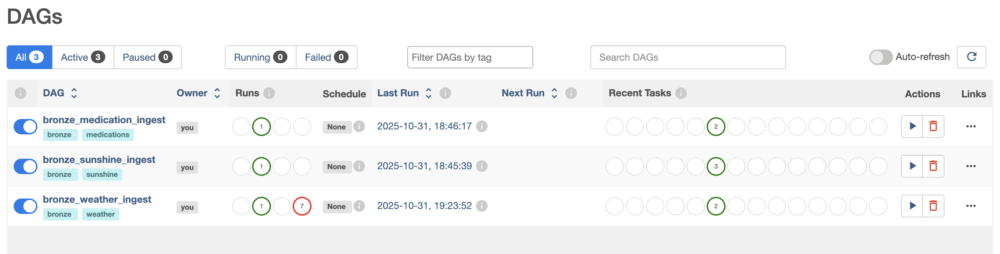
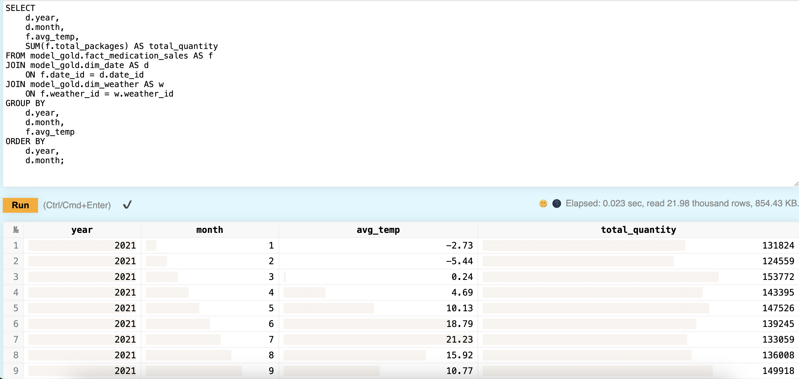
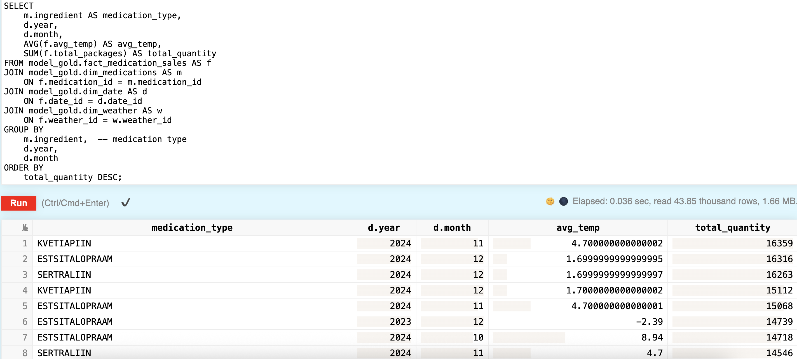
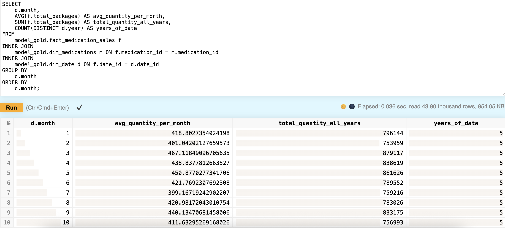

# Data Engineering 2025 – Project
**Group 4:** Annika Remmelgas, Agnes Kala, Imbi Jaks, Liis Andresen  

## Project Overview
This project implements a complete **data-warehouse & ETL pipeline** that analyzes how **weather conditions** and **sunshine** relate to **medication sales in Estonia**.

**Goal:** support healthcare planning by exploring correlations between climate and medication demand.  

**Key KPIs**
- Medications sold per month  
- Average temperature per month  
- Average sunny hours per month  

**Main business questions**
1. How does temperature affect medication sales?  
2. Which medication types show seasonal spikes?  
3. Does extreme weather drive specific prescriptions?

## How to set up project

1. git clone https://github.com/annikarrre/dataEng2025.git
2. cd DATAENG2025
3. cp .env.example .env
4. docker compose up -d --build
5. docker exec -it data_warehouse-clickhouse-1 clickhouse-client -u default --password mysecret --multiquery --queries-file=/sql/01_create_databases.sql
6. docker exec -it data_warehouse-clickhouse-1 clickhouse-client -u default --password mysecret --multiquery --queries-file=/sql/02_create_bronze_sunshine.sql
7. docker compose exec airflow-webserver airflow dags trigger bronze_sunshine_ingest
8. docker exec -it data_warehouse-clickhouse-1 clickhouse-client -u default --password mysecret --multiquery --queries-file=/sql/02_create_bronze_weather.sql
9. docker compose exec airflow-webserver airflow dags trigger bronze_weather_ingest
10. docker exec -it data_warehouse-clickhouse-1 clickhouse-client -u default --password mysecret --multiquery --queries-file=/sql/02_create_bronze_medication.sql
11. docker compose exec airflow-webserver airflow dags trigger bronze_medication_ingest
12. docker compose exec airflow-webserver bash -lc   'dbt run --profiles-dir /opt/airflow/dbt --project-dir /opt/airflow/dbt --select silver'
13. docker compose exec airflow-webserver bash -lc 'dbt run --profiles-dir /opt/airflow/dbt --project-dir /opt/airflow/dbt --select gold'

Kui vaja teha muudatusi pythoni failides, siis käivitada peale muudatuse tegemist:

1. docker compose restart airflow-webserver airflow-scheduler

## Screenshots
### Airflow DAG

### Demo Queries
**Q1: How does monthly average temperature affect the volume of medication
purchases?**

**Q2: Are there specific types of medications (cold/flu, allergy, depression) that show
seasonal spikes related to weather conditions?**

**Q5: How many of various medications should be supplied per period?**
